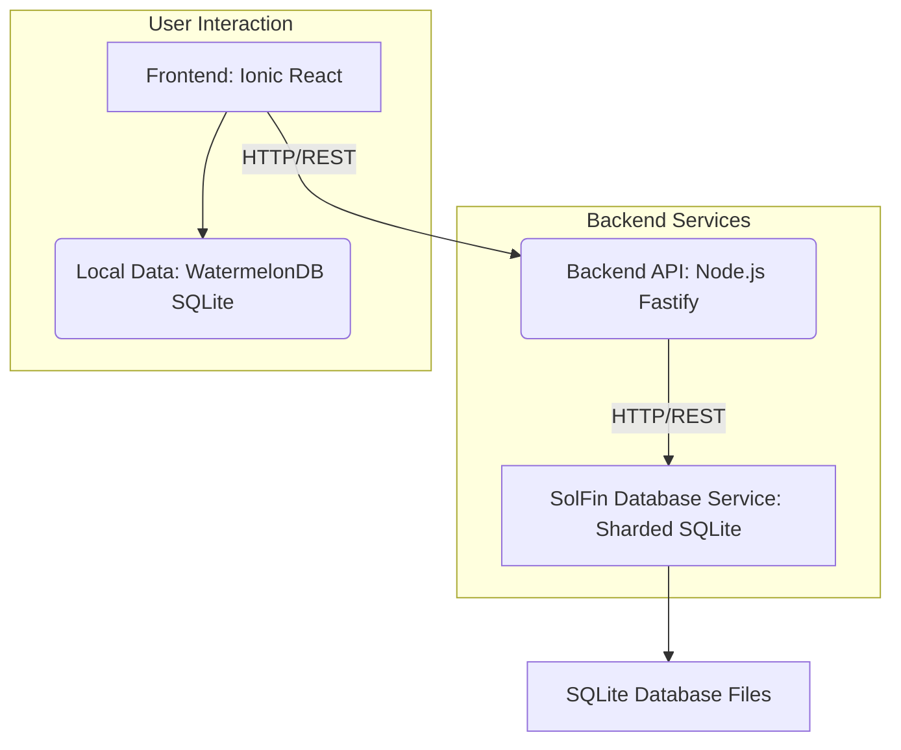

# SolFin Project Documentation

This repository contains the full codebase for SolFin, a personal and family finance planner. The project is designed with a microservices architecture, comprising a backend API, a dedicated database service, and a cross-platform frontend application.

## 1. Project Overview

SolFin aims to provide a robust, offline-first financial planning application with optional cloud synchronization and advanced features like receipt scanning using AI. It's built to be cross-platform, supporting Android, iOS, and Web PWA.

## 2. Architecture Overview

The SolFin project follows a clear microservices architecture, separating concerns into distinct services:



### 2.1. Frontend (Ionic React)

-   **Technology**: Built with Ionic React, enabling a single codebase for Android, iOS, and Web PWA.
-   **Local Data**: Utilizes WatermelonDB (SQLite) for offline-first capabilities.
-   **API Interaction**: Communicates with the Backend API for synchronization and advanced features.

### 2.2. Backend API (Node.js/Fastify)

-   **Technology**: Developed with Node.js and the Fastify web framework.
-   **Architecture**: Implements a Repository Pattern to abstract database operations.
-   **Data Access**: Communicates with the `SolFin Database Service` via HTTP/REST.
-   **Key Responsibilities**: User authentication, business logic, request validation, and response formatting.
-   **Dependencies**: `axios` (for DB service communication), `dotenv`, `fastify`, `bcrypt` (for password hashing).

### 2.3. SolFin Database Service (Node.js/SQLite)

-   **Technology**: A dedicated Node.js microservice managing sharded SQLite databases.
-   **Architecture**:
    -   **Sharded SQLite Cluster**: Data is partitioned across multiple SQLite databases (e.g., `users.db`, `accounts.db`, `transactions.db`, `pouches.db`, `transfers.db`).
    -   **Load Balancing**: Employs read/write separation with multiple read replicas per shard.
    -   **Migration & Seeder Management**: Handles database schema versioning and populating sample data.
-   **API**: Exposes a RESTful API for all database operations, used by the Backend API.
-   **Dependencies**: `fastify`, `sqlite3`, `better-sqlite3`, `uuid`, `dotenv`.

## 3. Development Setup

The project is structured as a monorepo.

### 3.1. Prerequisites

Ensure you have the following installed:
-   Node.js (LTS version recommended)
-   npm or Bun (used for package management)
-   Git
-   Docker and Docker Compose (for running services locally)
-   Optional: Ionic CLI, Capacitor CLI, JDK, Android Studio, Xcode (for mobile development)

### 3.2. Running with Docker Compose (Recommended)

The easiest way to get all services running is using Docker Compose:

1.  **Clone the Repository**:
    ```bash
    git clone [repository-url] solfin
    cd solfin
    ```
2.  **Build and Start Services**:
    ```bash
    docker compose up --build
    ```
    This command will:
    -   Build Docker images for `solfin_database`, `backend`, and `frontend`.
    -   Start all three services, ensuring `solfin_database` is up before `backend`, and `backend` before `frontend`.
    -   Persist database data in a Docker volume named `solfin_db_data`.

Once services are up:
-   **Frontend**: Accessible at `http://localhost:8080`
-   **Backend API**: Accessible at `http://localhost:3001`
-   **SolFin Database Service**: Accessible at `http://localhost:3002`

### 3.3. Individual Service Setup (Manual)

For individual service development or debugging:

#### 3.3.1. SolFin Database Service

1.  Navigate to the `solfin_database` directory:
    ```bash
    cd solfin_database
    ```
2.  Install dependencies:
    ```bash
    npm install
    ```
3.  Set up the database (run migrations and seeders):
    ```bash
    npm run db:setup
    ```
4.  Start the service:
    ```bash
    npm run dev
    ```
    The service will run on `http://localhost:3002`.

#### 3.3.2. Backend API

1.  Navigate to the `backend` directory:
    ```bash
    cd backend
    ```
2.  Install dependencies:
    ```bash
    bun install # or npm install
    ```
3.  Ensure `solfin_database` service is running (either via Docker Compose or manually).
4.  Start the service:
    ```bash
    bun --watch server.js # or npm start
    ```
    The API will run on `http://localhost:3001`.

#### 3.3.3. Frontend (Web PWA)

1.  Navigate to the `frontend` directory:
    ```bash
    cd frontend
    ```
2.  Install dependencies:
    ```bash
    bun install # or npm install
    ```
3.  Ensure `backend` service is running (either via Docker Compose or manually).
4.  Start the development server:
    ```bash
    bun run dev # or npm run dev
    ```
    The web PWA will typically open in your browser at `http://localhost:8080`.

## 4. Code Quality and Documentation Improvements (Plan)

This section outlines the plan for improving code quality and documentation without altering core logic. The goal is to enhance maintainability, readability, security, performance, and modularity, along with providing detailed in-code comments and a comprehensive `README.md`.

### 4.1. Detailed In-Code Comments

-   **Objective**: Add JSDoc-style comments for functions, classes, and complex logic blocks in both backend and frontend code. Explain purpose, parameters, return values, and potential side effects.
-   **Scope**:
    -   **Backend**: `server.js`, `routes/*.js`, `services/*.js`, `repositories/*.js`, `plugins/*.js`.
    -   **Frontend**: `src/**/*.tsx`, `src/**/*.ts`.
    -   **Database Service**: `solfin_database/lib/*.js`, `solfin_database/migrations/*.js`, `solfin_database/seeders/*.js`.

### 4.2. Code Quality Improvements

-   **Objective**: Apply best practices for readability, minor performance optimizations, security enhancements, and improved modularity.
-   **Areas of Focus**:
    -   **Readability**: Consistent naming conventions, clearer variable names, breaking down overly complex functions.
    -   **Modularity**: Ensure single responsibility principle where applicable, proper separation of concerns.
    -   **Minor Performance**: Optimizing loops, efficient data structures (if obvious and not logic-changing), minimizing redundant computations.
    -   **Security**: Reviewing and hardening authentication/authorization flows, ensuring proper input validation and error handling (beyond current basic setup).
    -   **Error Handling**: Standardizing error responses and logging across services.

### 4.3. `README.md` Enhancements

-   **Objective**: Make this `README.md` the primary, comprehensive entry point for the project.
-   **Content**:
    -   **Current**: Project Overview, Architecture Overview (with Mermaid diagram), Development Setup (Docker Compose & Manual).
    -   **To Add/Enhance**:
        -   Detailed functional overview (based on `docs/00-overview.md`).
        -   Contribution guidelines.
        -   Testing strategy.
        -   Deployment considerations.
        -   Troubleshooting common issues.
        -   Future roadmap (briefly).

---

**Next Steps:**

I will now identify specific areas in the code for detailed comments and propose concrete code quality improvements based on the understanding gained. This will involve a deeper dive into the code files already scanned.